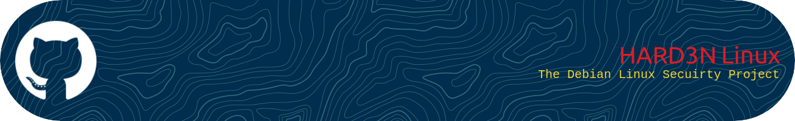

```bash
                      ####################################################################
                      #            H   H   AAAAA   RRRR    DDDD    333333    NN    N     #     
                      #           H   H  A     A  R   R   D   D       33    N N   N      #  
                      #          HHHHH  AAAAAAA  RRRR    D   D     33      N  N  N       # 
                      #         H   H  A     A  R  R    D   D       33    N   N N        #    
                      #        H   H  A     A  R   R   DDDD    333333    N    NN         #
                      ####################################################################
                      ##             "HARD3N" - The Linux Security Project              ##          
                      ##            ----------------------------------------            ##          
                      ##           A project focused on improving Debian Linux          ##          
                      ##            security through automating, containerizing         ##         
                      ##                        Hardening and                           ##        
                      ##                 System protection measures.                    ##         
                      ##           ----------------------------------------             ##                                       
                      ##                     License: MIT License                       ##   
                      ##                        Version: 1.3                            ##     
                      ##  GitHub: https://github.com/OpenSource-For-Freedom/Linux.git   ## 
                      ##                                                                ##
                      ####################################################################
```


##                                       ***Developer: Tim Burns***
##                                    ***Contact: Support@grdv.org***          


#                                     **The Linux + DevSec Project**: 
> ***Hard3n*** - A single Linux Package to Sandbox a Debian OS and supported systems, both endpoint and Server.


---


###                    			       Welcome! 

The **Linux** repository is dedicated to enhancing the security and functionality of Linux systems and Supported OS models and Networks. 

#                                            **Overview**

###       As a Linux System and Security Engineer it's you must pursue Security and 
###  creativity. In the development of this repository we want to include all facits of Kernal Hardening, 
###         Penetration testing and OS Security for Debian Linux Systems and not forget our root.

This document outlines the **pre-release activities** that need to be completed before we finalize the project release. These tasks are designed to reinforce the system's security posture, improve performance, and streamline user management.

We’ve included detailed descriptions for each task to give you a better understanding of their importance. With this, you’ll be ready to dive deep into Debian system hardening and optimization, ensuring your system is secure,  a tight button of fun, stable, and efficient. Availability and Security is our goal. 

##                             Task List: Pre-Release Activities / Research

##                                    [System Hardening Research] 

### Review and Analyze Hardening Scripts:
Study functional system hardening scripts like harbian-audit. These scripts provide a blueprint for how security measures should be structured, implemented, and executed across Linux systems.

***Objective*** To understand their structure, logic, and methods for mitigating security vulnerabilities, and apply them in our own hardening process.

***Importance*** Ensures we are adopting best practices in system hardening that are widely recognized and tested in the security community that will
All Production and Security to live in one biome. 

##                                      [Permission Security] 

### Evaluate Special Permissions:
Special file permissions like setuid, setgid, and sticky have specific implications for system security. We need to carefully evaluate the risk of removing these from executables.
***Objective***  Safely remove or modify unnecessary special permissions to reduce potential attack surfaces.
***Note*** Incorrect changes could compromise system stability. Always perform tests in a controlled environment first.

##                                    [User Group Configuration] 

### Console User Group Analysis in Whonix:
Whonix is a security-focused Linux distribution that uses anonymity via Tor. Within Whonix, the console user group plays a role in user management and system access.
***Objective*** Investigate the necessity of this group, explore any potential for improvements, and evaluate whether additional user groups might improve security.
***Importance*** Proper user group management helps reduce the potential for privilege escalation and unauthorized access.
		
##                                     [Security Enhancements] 

### Track and Document Setgid Permissions (Idea)

###                                 ***Run the following command***

```
find / -mount -perm -2000 -type f -exec ls -ld {} \; > /home/user/setgid_.txt && chown -v user:user /home/user/setgid_.txt
```

This command will locate all files with setgid permissions and save them to a file called setgid_.txt in the /home/user/ directory. 

***Objective*** Review files with elevated permissions and document them for further analysis.
Note: Misconfigured setgid files can lead to privilege escalation vulnerabilities. This process helps ensure only legitimate files have these permissions.

##                                [Ongoing Future Configurations] 

### 		       There is great need to continue finding and testing 
###                      the "best" hardening scripts and polices as a 
###                                     Collective

### Modify Security Settings:
Explore security configuration files located in /etc/security and /etc/host.conf. Modify them to enhance system hardening and enable grub updating and hardeing. 

***Objective*** : Tighten system settings and prevent unauthorized access or privilege escalation.

***Example Configurations***

> Configure password expiration policies.
```
# -M 90= sets the max days, -m 7= sets the minimum days a password can be changed, -A 14= that is the warning period before expiration
# all settigns can be adjusted to the admin spec or users preference. 

sudo chage -M 90 -m 7 -W 14 username 
```
> Restrict sudo permissions.
```
sudo visudo # to edit sudo user
```
```
username ALL=(ALL) ALL, !/bin/su, !/usr/bin/passwd # java that allows sudo most, but restircts /bin/su and /usr/bin/passed
```

> Sandbox .grub and enable secure updating
> Using AppArmor :)
```
sudo apt install apparmor
sudo systemctl enable apparmor
sudo systemctl start apparmor
```
```
sudo nano /etc/apparmor.d/usr.sbin.grub
```
```
/usr/sbin/grub2-mkconfig ixr,
/usr/sbin/grub-install ixr,
/etc/grub.d/** r,
/boot/grub/** rw,
/dev/sda r,
```
```
sudo apparmor_parser -r /etc/apparmor.d/usr.sbin.grub
```
> Allow Grub updating
```
sudo apt install unattended-upgrades
```
> Edit the apt.conf.d file
```
sudo nano /etc/apt/apt.conf.d/50unattended-upgrades
```
> Add this linefor Grub updating
```
"Package-Blacklist": {
    // Leave blank to allow all packages, or blacklist specific ones
},
"Allowed-Origins": {
    "Debian": "${distro_id}:${distro_codename}-updates";
}

```
> Then Allow Unatended Upgrade
```
sudo dpkg-reconfigure -plow unattended-upgrades
```
> Update Grub
```
sudo update-grub
```
Restirct Certian Grub files so only root has access
```
sudo chmod 600 /boot/grub/grub.cfg
sudo chown root:root /boot/grub/grub.cfg
sudo chmod -R 700 /etc/grub.d/
```
> Verify
```
ls -l /boot/grub/
ls -l /etc/grub.d/
```

> Enforce account lockout after a number of failed login attempts.

> Open PAM
```
sudo nano /etc/pam.d/common-auth

```
> Add this line on the top

```
auth required pam_tally2.so deny=3 unlock_time=300
```
> Mod PAM account file
```
sudo nano /etc/pam.d/common-account
```
> Add this at top
```
account required Linux_User_1.so
```
> The verify User account Lockout policy

> Harden Netowkr Parameters using Kernal

> Open
```
sudo nano /etc/systctl.conf
```
> Add this to the file
```
net.ipv4.conf.all.rp_filter = 1
net.ipv4.conf.default.rp_filter = 1
net.ipv4.tcp_syncookies = 1
net.ipv4.icmp_echo_ignore_broadcasts = 1
net.ipv4.icmp_ignore_bogus_error_responses = 1
net.ipv4.tcp_timestamps = 0
net.ipv4.conf.all.accept_source_route = 0
net.ipv4.conf.default.accept_source_route = 0
net.ipv6.conf.all.accept_source_route = 0
net.ipv6.conf.default.accept_source_route = 0
net.ipv6.conf.all.accept_redirects = 0
net.ipv6.conf.default.accept_redirects = 0
```
> Apply the change
```
sudo sysctl -p
```

##                            Other Critical Pre-Release Steps 

***Audit Logs*** Make sure logging and monitoring configurations are enabled. Set up automated log analysis to quickly detect suspicious activity.
***Backup & Recovery Plan*** Ensure a backup strategy is in place for both system configurations and critical data.
***Test*** Before finalizing the release, thoroughly test all security measures in a staging environment. This ensures the changes won't break functionality or introduce new issues.
***CRONJOB*** Empliment a cronjob for updating, monitring and change orders needed if users desire diffent containerization, secirity or Kernal monitoring. 


##                            System Hardening Tools to Implimented 

Here are some tools you may want to use as part of the hardening process:

***Lynis*** A security auditing tool for Unix-based systems.
***Fail2Ban*** Protects against brute-force attacks.
***UFW (Uncomplicated Firewall)*** Easy-to-configure firewall utility for restricting access.
***AppArmor*** Mandatory Access Control (MAC) system for enforcing security policies.
***ClamAV*** Open-source antivirus software for detecting malicious content.
***Firejail*** A sandboxing tool that helps isolate applications and prevent security breaches.

##                                         Conclusion 

By completing the tasks outlined above, we will ensure that the Hard3n_Linux project is ready for release with robust security and optimized performance. These steps are critical for enhancing the system’s defense against potential attacks and ensuring stable functionality.

Let's keep the security momentum going, and prepare for the exciting release of Hard3n_Linux! 🚀

##                                 Take Aways and Next Steps

Complete the tasks above with attention to detail.
Document any changes made during the hardening process for future reference.
Test the system in a staging environment.
Schedule a final review before release.

##                        Security First, Open Source for Freedom 🛡️


           


