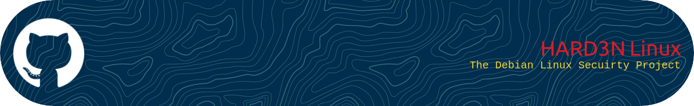

<p align="center">
    
</p>

##                                       ***Developer: Tim Burns***
##                                   

# **The Linux + DevSec Project**  


---


### **HARDN** - A single Linux package to sandbox a Debian OS and support systems, both endpoint and server.


### **CRACK** - a single WPA cracking tool to ensure your wifi is secure


                                                            

### **VeriFy** - A NEt Scanning tool that enumerates open ports, using dpkt and outputs that report on a file path for pen testers and red team members. 


---
# **Overview**  

In the development of this repository, we aim to include all facets of **kernel hardening**, **penetration testing**, and **OS security** for Debian Linux systems, ensuring both security and stability.

This document outlines the pre-release activities that need to be completed before finalizing the project release. These tasks are designed to reinforce security, improve performance, and streamline user management.

By following these guidelines, you will enhance system security, maintain stability, and optimize Debian-based systems for performance and resilience.

---

## **Pre-Release Activities & Research**

### **System Hardening Research**

- **Review and analyze hardening scripts**  
  Study system-hardening scripts like **harbian-audit** to identify security best practices.  
  **Objective:** Adopt tested hardening methods for better security.  

### **Permission Security**  

- **Evaluate special permissions**  
  Permissions like `setuid`, `setgid`, and `sticky` can be a security risk.  
  **Objective:** Remove unnecessary permissions while ensuring system stability.  

### **User Group Configuration**  

- **Console User Group Analysis in Whonix**  
  Investigate **Whonix's** console user groups to improve security management.  
  **Objective:** Reduce the risk of privilege escalation.  
  - a huge thank you to @kiukiucat for adding this. 

---

## **Security Enhancements**
### Here we can go over some basic sec permsion and configuration lines to get you started. 

### **Track and Document Setgid Permissions**

Run the following command to identify files with `setgid` permissions:

```
find / -mount -perm -2000 -type f -exec ls -ld {} \; > /home/user/setgid_.txt && chown -v user:user /home/user/setgid_.txt
```
Objective: Document privileged files and minimize risks associated with misconfigured permissions.

### Ongoing Future Configurations

Security Settings and Modifications
- Modify security configuration files
Located in /etc/security and /etc/host.conf to enhance system protection.
- Set password expiration policies:
```
sudo chage -M 90 -m 7 -W 14 username
```

Restrict sudo permissions:
```
sudo visudo
```
Add:
```
username ALL=(ALL) ALL, !/bin/su, !/usr/bin/passwd
```

### Sandbox GRUB and enable secure updates
Install and enable AppArmor:
```
sudo apt install apparmor
sudo systemctl enable apparmor
sudo systemctl start apparmor
```
Configure AppArmor for GRUB:
```
sudo nano /etc/apparmor.d/usr.sbin.grub
```
Add:
```
/usr/sbin/grub2-mkconfig ixr,
/usr/sbin/grub-install ixr,
/etc/grub.d/** r,
/boot/grub/** rw,
/dev/sda r,
```
Apply the configuration:
```
sudo apparmor_parser -r /etc/apparmor.d/usr.sbin.grub
```

### Enable unattended security updates:
```
sudo apt install unattended-upgrades
sudo nano /etc/apt/apt.conf.d/50unattended-upgrades
```
Add:
```
"Allowed-Origins": {
    "Debian": "${distro_id}:${distro_codename}-updates";
}
```
Enable:
```
sudo dpkg-reconfigure -plow unattended-upgrades
```

Harden network parameters:
```
sudo nano /etc/sysctl.conf
```
Add:
```
net.ipv4.conf.all.rp_filter = 1
net.ipv4.tcp_syncookies = 1
net.ipv4.icmp_echo_ignore_broadcasts = 1
net.ipv6.conf.all.accept_source_route = 0
net.ipv6.conf.all.accept_redirects = 0
```

Apply changes:

```
sudo sysctl -p
```

### Critical Pre-Release Steps
Audit logs: Enable security logging and set up automated log analysis.
Backup & Recovery Plan: Implement a reliable system backup strategy.
Testing: Ensure all security measures work properly before release.
CRON jobs: Automate updates and system security monitoring.

### System Hardening Tools

Tool,Description
Lynis,Security auditing tool for Unix-based systems.
Fail2Ban,Protects against brute-force attacks.
UFW,Easy-to-configure firewall utility.
AppArmor,Mandatory Access Control (MAC) for enforcing policies.
ClamAV,Open-source antivirus software.
Firejail,Sandboxing tool for application isolation.

### Takeaways and Next Steps

✔Complete all outlined hardening tasks.
✔Document all changes and configurations.
✔Conduct rigorous system testing.
✔Schedule a final review before the official release.

## Security First! Always Stay Open Source for Freedom 

<p align="center">
    
</p>


<p align="center">
    
</p>


